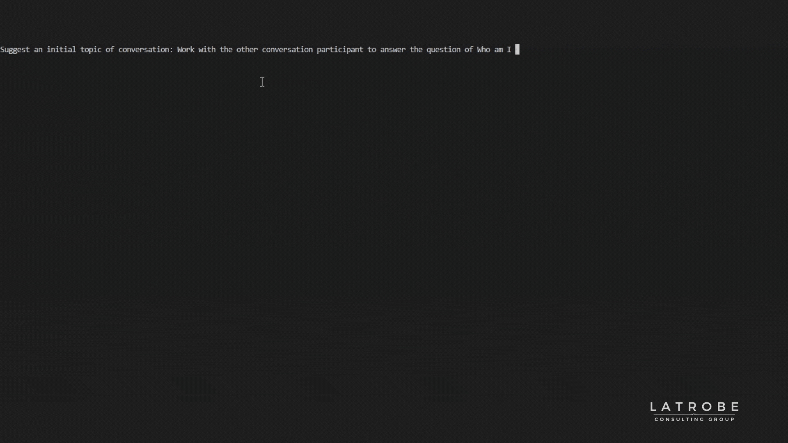

# SecondBrain-AI

SecondBrain is an intelligent virtual assistant powered by Python, LangChain, and OpenAI. Its purpose is to serve as a functional second brain to help manage a variety of workloads, increase productivity, and reduce cognitive overload. Right now, we are at in an experimental phase where we are conducting theory of mind experiments by getting SecondBrain to talk to itself - a necessary precursor to developing a true understanding of what someone else really wants is being able to create a simple mental model of them in your own head, called a Theory of Mind in psychology.

## Example

## Purpose

The concept of a "Second Brain" is a methodology for saving and systematically reminding us of the ideas, inspirations, insights, and connections we've gained through our experiences. By creating an external, digital repository of the things we learn, we can significantly reduce cognitive load, streamline our workflows, improve decision-making, enhance creativity and innovation, and boost mental health.

SecondBrain, the app, aims to take this concept to the next level by leveraging the power of language models and the LangChain framework. It serves as a personal assistant that not only stores and organizes information but also understands it, connects it, and uses it to assist the user in making decisions and solving problems.

## Background

**LangChain**

LangChain is a framework for developing applications powered by language models. It supports a range of modules, including models, prompts, memory, indexes, chains, and agents, enabling language models to interact with data and environments in complex ways. LangChain can be used to create applications that can remember interactions, answer questions, interact with APIs, extract structured information from text, and much more.

**Language Models**

Language models are AI models that can understand, generate, and do tasks with human language. They are trained on a wide variety of internet text, learning grammar, facts about the world, reasoning abilities, and also some of the biases in the data they were trained on. OpenAI's language models, such as GPT-3 and Codex, are leading examples of this technology.

**Second Brains**

A Second Brain is an external, digital repository where you store the ideas, inspirations, insights, and connections you've gained through your experiences. It serves as an extension of your own brain, reducing cognitive load and increasing efficiency. It is a methodology for offloading the task of remembering and connecting information to a digital tool, freeing your mind to focus on creativity and critical thinking.

## Project Structure

The SecondBrain project is organized into several directories, each with a specific purpose:

- `./manager/`: This directory contains the Python code and Dockerfile for the manager. The manager is a LangChain agent that receives initial requests from the user and dispatches the content editor to assemble a response.

- `./editor/`: This directory contains the Python code and Dockerfile for the editor. The editor is the AI component that uses multiple instances of a researcher to generate a well-written response for a query.

- `./researcher/`: This directory contains the Python code and Dockerfile for the researcher. The researcher is a LangChain agent that can be passed a number of Tools to perform searches, lookups or API requests needed to gather information for researched responses back to the editor.

- `./tracing/`: This directory sets up the LangChain tracing server for debugging agent execution chains.

- `./workflows/`: This directory controls the GitHub Actions workflows that build the images, deploy them to the container registry, and set them up for deployment.

These components work together to provide the functionality of the SecondBrain application.

## Contributing to SecondBrain

We welcome contributions to SecondBrain! There are several ways you can contribute:

### Fork the Codebase

You can fork the SecondBrain codebase, make changes, and propose those changes via a pull request. Here's how:

1. Go to the [SecondBrain repository](https://github.com/jacklatrobe/secondbrain-ai).
2. Click the "Fork" button in the top-right of the page.
3. Clone the forked repository to your local machine and make your changes.
4. Push your changes to your forked repository.
5. Go back to the [SecondBrain repository](https://github.com/jacklatrobe/secondbrain-ai) and click "New pull request."
6. Click "compare across forks" and select your fork from the dropdown menu.
7. Click "Create pull request" to propose your changes.

### Raise Issues

If you encounter any bugs or issues with SecondBrain, please let us know by raising an issue on our [GitHub page](https://github.com/jacklatrobe/secondbrain-ai/issues). Be sure to provide as much detail as possible, including steps to reproduce the issue and any error messages you receive.

## License

SecondBrain is licensed under the MIT License. The terms of the MIT License offer wide freedoms to use, copy, modify, merge, publish, distribute, sublicense, and/or sell copies of the software.

The full terms of the license can be found at [MIT License | Open Source Initiative](https://opensource.org/licenses/MIT). By using, copying, or modifying SecondBrain, you are agreeing to be bound by the terms of the MIT License.

## Contact

SecondBrain is a project developed and maintained by Latrobe Consulting Group (LCG), an Australian-based technology and business advisory firm. LCG is committed to providing holistic solutions for product and technology challenges, harnessing the power of a broad network of professionals to deliver best-practice, tailored solutions. 

LCG's philosophy in developing cutting-edge solutions using technologies like language models is rooted in our core values: prioritizing integrity, fostering safety through clear communication, embracing curiosity over fear, and promoting continuous growth through action-oriented learning and innovation.

For more information about LCG or if you have any questions about the SecondBrain project, please visit the [LCG website](https://latrobe.group/).
